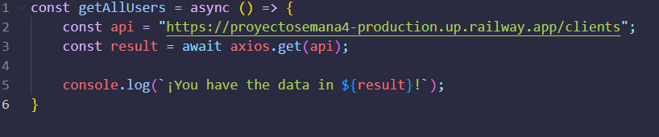
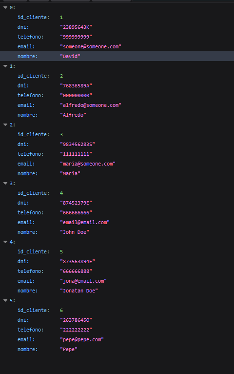

# API JAVASCRIPT

## Table of Contents

- [Description](#desc)
- [Requisites](#requisites)
- [Usage](#usage)
- [Example code](#example)
- [Endpoints](#endpoints)

## Description 

An API using only JavaScript, frameworks/libraries: Express and Sequelize, database done in MySQL.

## Requisites 

- You need Node.js
- Optional: Postman or similar to test the API calls.

## Usage 

- Clone or copy this repository: 

        git clone https://github.com/davidpalacin/proyectoSemana4.git
- To install all the dependencies: npm install
- You are ready to use API URLs, example with axios: (This example returns all the clients in database).

        const api = "https://proyectosemana4-production.up.railway.app/clients";

        const result = await axios.get(api);

- Now you have the API results in result variable

## Example code 

- Response:

# Endpoints 
## Clients
- (base-url)/clients --> Return all the clients

- (base-url)/clients/2 --> Return client with id 2
- (base-url)/clients/name/John Doe --> Return clients with name John Doe
- (base-url)/clients/dni/99999999F --> return the client with dni 99999999F
- (base-url)/clients/phone/666666666 --> Return the client with phone number 666666666
- (base-url)/clients/email/someone@someone.com --> Return the client with email someone@someone.com
- (base-url)/clients/name/like/Da --> Return clients with name like "Da" for example David

## Hotels
- (base-url)/hotels --> Return all hotels

- (base-url)/hotels/2 --> Return the hotel with id 2
- (base-url)/hotels/Palace --> Return the hotel with name Palace

## Reservations
- (base-url)/reserv --> Return all the reservations

- (base-url)/reserv/2 --> Return reservation with id 2
- (base-url)/reserv/entrydate/2022-06-06 --> Return reservation with entry date 2022-06-06
- (base-url)/reserv/finaldate/2022-06-12 --> Return reservation with entry date 2022-06-12
- (base-url)/reserv/id/1/entrydate/2022-06-06 --> Return reservation with id 1 and entry date 2022-06-06
- (base-url)/reserv/idClient/3 --> Return reservations of the client with id 3
